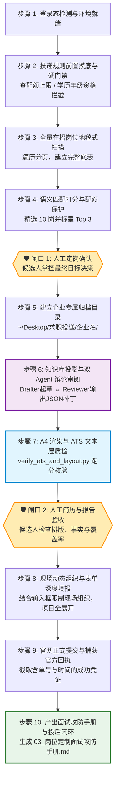

# Job Application Pipeline 🚀 v2.0

> **企业校招与实习投递全流程自动化 Agent Skill（工业级求职操作系统）**  
> *以本地真实工程资产为唯一真理源，拒绝模型幻觉与虚假包装；前置资格门禁、Drafter-Reviewer 辩论质检、单页 A4 矢量定制、ATS 文本层机器扫描、现场动态表单组织、官网真机填报与投后面试攻防手册闭环。*

[](SKILL.md)
[](LICENSE)
[](SKILL.md)
[](scripts/verify_ats_and_layout.py)
[](#-实战战绩)

---

## 🧬 v2.0 重大架构升级与致敬致谢

本项目 v2.0 深度吸收并借鉴了优秀开源项目 [MadsLorentzen/ai-job-search](https://github.com/MadsLorentzen/ai-job-search) 的架构哲学，并在其纯 CLI 文书推演的基础上完成了**工程化质变与自动化闭环跨越**：

### 1. 深度借鉴的核心架构精髓
* **前置硬性门禁（Eligibility Gate）**：防盲目投递。结合大厂配额限制（如字节校招仅 2 次投递机会），前置严格核算学历、年级、实习周期与技术栈重合度，绝不浪费宝贵配额。
* **Drafter-Reviewer 辩论式双 Agent 审阅机制**：起草 Agent 针对 JD 装配经历，审阅 Agent（模拟刻薄面试官）对照审查红线（[`references/reviewer_rubric.md`](references/reviewer_rubric.md)）严厉挑刺，输出机器可解析的 **Part A JSON 字符串替换补丁**，把幻觉、时间混乱与排版瑕疵彻底阻断在提交之前。
* **ATS 纯文本图层提取与单页物理排版拦截（[`scripts/verify_ats_and_layout.py`](scripts/verify_ats_and_layout.py)）**：拒绝只看人眼渲染效果。用代码模拟大厂招聘系统爬虫，提取 PDF 纯文本流，确保手机/邮箱抗乱码无损检索，并输出 **关键词覆盖率矩阵（Keyword Coverage Matrix）**。
* **投后面试攻防闭环（Interview Defense & Mock Arena）**：借鉴 `/interview` 思想，投递成功的瞬间自动输出专属的 **《03_岗位定制面试攻防手册.md》**，提供简历技术诱饵透视、L1-L3 技术深挖反制网与 JD 技能盲区破局话术。

### 2. 本项目完成的降维打击式跨越（突破原项目的物理天花板）
* ⚠️ **原项目最大的短板是 0 浏览器自动化（Zero Browser Automation）**：代码止步于在本地生成 LaTeX PDF，无法进入任何招聘官网，网申填表仍需人类肉身一个字段一个字段复制粘贴。
* 🔥 **本项目彻底打通了“最后一公里”**：依托 `ego-browser` 深度驾驭真实企业 ATS（飞书、Moka、北森、大厂自建），搞定登录态保持、展开所有折叠项目块、**根据现场题目字数限制即时动态组织高质量回答（Context-Aware JIT Synthesis）**、零报错提交并截取带单号的官方成功回执！

---

## 🏗️ 全生命周期 10 步标准作业流程（SOP）



---

## 🌟 核心工程组件与规范

### 1. ATS 文本层与 A4 单页自动化质检工具 (`scripts/verify_ats_and_layout.py`)
运行示例：
```bash
python3 scripts/verify_ats_and_layout.py   --pdf "~/Desktop/求职投递/字节跳动/刘仁晓君_字节跳动_前端开发实习生.pdf"   --keywords "React" "TypeScript" "SSE" "微服务" "高并发"
```
报告输出：
* ✅ 物理单页拦截：严格 1 页（0 溢出）；
* ✅ ATS 关键信息检索：姓名、手机号、邮箱 100% 无损提取，杜绝特殊图标字符导致吞字；
* ✅ 事实铁律扫描：深古实习周期严禁“至今”，教育背景单行化；
* ✅ 关键词覆盖率矩阵：输出命中率得分（如 75%）与缺失词预警。

### 2. 现场动态深度组织（Context-Aware JIT Synthesis）
摒弃呆板预制文本，当 Agent 在真机网申页面遇到开放题与大段文本框时：
* 自动抓取输入框的题目（Label）、提示（Placeholder）与字数硬约束（`maxlength`）；
* 调取候选人底层知识库，结合目标部门的具体业务场景，现场组织契合度极高、语言自然且精准切题的个性化长文本与开放问答。

### 3. 投后岗位专属《03_岗位定制面试攻防手册.md》
投递完成后的归档目录标准五件套：
```text
📁 ~/Desktop/求职投递/<企业名称>/
├── 📄 01_岗位分析与投递规则.md       # 包含规则、全量扫描岗位表、精选 10 岗与推荐理由
├── 📄 姓名_企业名_岗位名.pdf          # 通过 ATS 质检的单页矢量定制简历
├── 🖼️ 02_官网投递成功回执.png        # 官网官方提交成功凭证截图
├── 📄 03_岗位定制面试攻防手册.md     # 【v2.0新增】简历诱饵透视、L1-L3反制网、JD盲区破局
└── 📝 投递追踪记录.md                # 明确标记状态为 [已投递]，记录候选人系统编号
```

---

## 📊 方案横向对比（v2.0 工业级标准）

| 维度 | 普通招聘脚本 / 自动投递插件 | ai-job-search (CLI) | **本项目 (job-application-pipeline v2.0)** |
| :--- | :--- | :--- | :--- |
| **底层实现** | 纯 DOM 点击 / 简单外挂 | 纯本地 CLI / LaTeX | **复合 Agent Skill + 独立 Python 质检工具箱 + 知识库底座** |
| **简历质检** | ❌ 无质检 | ✅ LaTeX ATS 文本层检验 | **✅ 双 Agent 对抗审查（JSON补丁） + Python ATS 文本层扫描** |
| **规则感知** | ❌ 忽视配额，容易盲投挂号 | ✅ 前置硬门禁 | **✅ 规则摸底 + 配额硬门禁（学历、年级、专项通道）** |
| **真机网申** | ❌ 仅上传附件或简填基础字段 | ❌ **完全无浏览器自动化** | **✅ ego-browser 真实浏览器填报，现场动态组织，0 留白** |
| **人机安全** | ❌ 全自动乱点，容易封号或错投 | ⚠️ 依赖手动触发命令 | **✅ 双道强制人工审批闸门（选岗确认 + 简历确认）** |
| **投后闭环** | ❌ 无凭据沉淀 | ✅ 生成面试题 | **✅ 官方回执高清截屏 + 专属 03_面试攻防手册 + 一键 Mock 对战** |

---

## 🚀 快速开始

### 1. 安装 Skill 至你的 Agent 环境
```bash
git clone https://github.com/qingcheng66/job-application-pipeline.git
# 将本仓库链接或配置入你的 Agent（Antigravity / Claude Code / OpenCode）
```

### 2. 一句话触发投递流水线
在聊天窗口中发送企业招聘网址：
> *“帮我投递这个企业官网：https://jobs.bytedance.com/referral/campus/pc/position/detail/...”*

Agent 将自动接管并严格按照 10 步 SOP 执行，在**选岗**和**简历审核**节点主动汇报等待你的决策！

---

## 🎖️ 实战战绩

本项目已在大厂及独角兽校招实战中成功交付并验证：
* ✅ **字节跳动 (ByteDance)**：中国交易与广告（抖音生活服务达人方向）前端开发实习生，A4 单页矢量定制、ATS 文本层 75% 高分质检通过、真机全字段结构化填报并生成专属面试攻防手册！
* ✅ **大疆创新 (DJI)**：常规校招 + 数字管理构建者计划（双岗位配额拉满达成，全字段结构化填报）
* ✅ **哈啰出行 (Hellobike)**：北森 ATS 官网直投，绑定专属内推码，3 大项目结构化填报入库
* ✅ **MiniMax (名之梦)**：飞书 ATS 官网直投，Agent 服务端开发实习生投递成功
* ✅ **影石创新 (Insta360)**：飞书 ATS 官网直投，DataAgent 全栈开发实习生投递成功
* ✅ **美团 (Meituan)**：扫描 307 个技术岗位，精选 Top 10，绑定专属内推码，AI 全栈简历定制完毕

---

## 🤝 致谢与许可

- 特别致谢 [MadsLorentzen/ai-job-search](https://github.com/MadsLorentzen/ai-job-search) 提供的优秀 CLI 架构与质检设计思想。
- 本项目基于 [MIT License](LICENSE) 开源。
