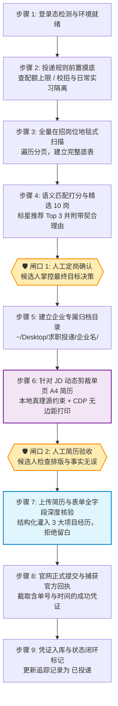

# Job Application Pipeline 🚀

> **企业校招与实习投递全流程自动化 Agent Skill（标准作业规范与执行引擎）**  
> *以本地真实工程资产为唯一真理源，拒绝模型幻觉与虚假包装；规则前置摸底、针对性单页 A4 矢量定制、双安全闸门、ATS 全字段深度填报核验与凭据归档闭环。*

[](LICENSE)
[](SKILL.md)
[](docs/ats-anti-truncation.md)
[](#实战战绩)

---

## 💡 为什么需要这个项目？

目前市面上的“求职自动化工具”普遍存在四大致命缺陷：
1. **盲目海投，浪费配额**：各大厂校招有严格的投递次数上限（通常仅 1~3 个志愿），无脑脚本极易误投低匹配度岗位，导致本招聘季直接废号；
2. **千篇一律，初筛秒拒**：上传固定的一份通用 PDF 简历，面对不同业务线（Agent研发 vs 高并发后端 vs 算法落地）无法突出针对性优势；
3. **只传附件，表单空白**：90% 的自动化脚本仅上传 PDF，然而主流 ATS 系统（飞书、北森、Moka、自建系统）后台初筛首先是用 ElasticSearch 对**网页结构化表单**进行关键字召回打分，表单留白直接导致在第一轮算法筛选中出局；
4. **模型幻觉，虚假编造**：缺乏真实事实源约束的 AI 生成器容易“凭空捏造未做过的项目”，面试一问即穿，甚至被拉入大厂诚信黑名单。

**`job-application-pipeline` 就是为了彻底终结这些痛点而生的工业级解决方案。**

---

## 🏗️ 核心架构与 9 步标准作业流程（SOP）

本项目通过将大模型的语义理解能力与浏览器的精准自动化（CDP / DOM）结合，并坚守**“两道强制人工审核闸门”**，实现高命中率、高严谨度的投递闭环：



---

## 🌟 四大杀手级核心特性

### 1. 投递规则前置摸底（Pre-Discovery Protocol）
在翻阅岗位前，首先穿透企业招聘系统 FAQ 与个人中心，探查核心规则：
* **配额限制**：最多允许同时投递几个岗位（如 MiniMax 限制 3 个，部分限制 1 个）；
* **配额隔离**：秋招（校招）与日常实习是否共享配额；
* **免配额专项挖掘**：如大疆的“数字管理构建者计划”可额外多投 1 次且不占校招次数，最大化利用投递名额。

### 2. 真实事实源（SSOT）动态剪裁与 A4 矢量排版
* 建立 `resume-master-bank.md` 作为个人经历的唯一真理源，严禁 AI 编造假数据；
* 针对目标岗位 JD 进行逆向关键词解构，动态提取最匹配的 3 个项目；
* 动词与核心技术前置，基于 Headless CDP（`Page.printToPDF`）调用无边距绝对定位，生成 **100% 满版单页 A4 矢量 PDF**，绝不跨页溢出。

### 3. ATS 表单全字段深度填报核验（Deep Form Audit）
* 拒绝传统脚本“只上传附件”的敷衍逻辑；
* 展开表单折叠区域，主动将 3 个项目按结构化文本（项目名、角色、起止时间、核心成果）灌入网页输入框；
* 严格遵循三大铁律：文件名无“一页精简简历”、实习经历锁定时间**严禁标注“至今”**、教育经历无花哨彩色徽章。

### 4. 专属目录标准化四件套归档
每次任务自动在本地创建标准归档：
```text
📁 ~/Desktop/求职投递/<企业名称>/
├── 📄 01_岗位分析与投递规则.md       # 包含规则、全量扫描岗位表、精选 10 岗与推荐理由
├── 📄 姓名_企业名_岗位名.pdf          # 严格 A4 单页矢量定制简历
├── 🖼️ 02_官网投递成功回执.png        # 官网官方提交成功凭证截图
└── 📝 投递追踪记录.md                # 明确标记状态为 [已投递]，记录候选人系统编号
```

---

## 📊 方案横向对比

| 维度 | 普通招聘脚本 / 自动投递插件 | 传统聊天式 AI 助手 | **本项目 (job-application-pipeline)** |
| :--- | :--- | :--- | :--- |
| **底层实现** | 纯 DOM 点击 / 简单外挂 | 零散无状态多轮对话 | **Agent Skill + 确定性脚本 + Headless CDP 渲染** |
| **简历定制** | ❌ 只能上传固定一份通用 PDF | ⚠️ 易产生虚假捏造与幻觉 | **✅ 以本地真实资产为真理源，针对 JD 逆向剪裁** |
| **规则感知** | ❌ 忽视配额，容易浪费投递次数 | ❌ 无法感知复杂招聘限制 | **✅ 规则前置摸底（探明配额、隔离与专项通道）** |
| **表单填报** | ❌ 仅上传附件或简填基础字段 | ❌ 无法在真实浏览器中操作 | **✅ 全字段深度核验，结构化主动补齐三大项目** |
| **人机安全** | ❌ 全自动乱点，容易封号或错投 | ❌ 缺乏流程卡点控制 | **✅ 双道人工审批闸门（选岗确认 + 简历确认）** |
| **交付归档** | ❌ 无凭据沉淀 | ❌ 聊天关掉即丢 | **✅ 企业专属四件套物理落盘，可追溯可查验** |

---

## 🚀 快速开始

### 1. 安装 Skill 至你的 Agent 环境
本 Skill 通用适配主流 AI Agent 环境（如 **Antigravity**、**Claude Code**、**Hermes**、**OpenCode**）：

```bash
# 克隆本仓库
git clone https://github.com/qingcheng66/job-application-pipeline.git

# 复制或软链接 SKILL.md 到你的 agent skills 目录
# 以 Antigravity / Gemini 为例：
cp job-application-pipeline/SKILL.md ~/.gemini/config/skills/job-application-pipeline/SKILL.md
```

### 2. 初始化你的个人事实源
参考 `templates/resume-master-bank.sample.md`，建立属于你自己的个人素材库，列出你的真实项目与量化指标。

### 3. 一句话触发投递流水线
在你的 Agent 聊天窗口中发送企业招聘网址：
> *“帮我投递这个企业官网：https://arashivision.jobs.feishu.cn/campus/”*

Agent 将自动接管并严格按照 9 步 SOP 执行，在**选岗**和**简历审核**节点主动汇报等待你的指令！

---

## 📂 仓库目录结构

```text
job-application-pipeline/
├── 📄 README.md                      # 中英双语顶级开源自述文件
├── 📄 SKILL.md                       # Agent Skill 核心规范定义
├── 📄 DELIVERY_SOP.md                # 9 步标准作业程序与核验铁律
├── 📄 LICENSE                        # MIT 开源协议
│
├── 📁 templates/                     # 开箱即用模版库
│   ├── 📄 resume-master-bank.sample.md  # 个人素材母库样例
│   ├── 📄 resume-a4-template.html       # 绝对尺寸 A4 单页 HTML 简历模板
│   └── 📄 01_rules_and_jobs.sample.md   # 规则与岗位分析报告样例
│
├── 📁 scripts/                       # 辅助工具集
│   ├── 🛠️ print-a4-pdf.js               # CDP 无边距矢量 A4 PDF 打印器
│   ├── 🛠️ feishu-crawler.js             # 飞书招聘 DOM 解析脚本
│   └── 🛠️ form-auditor.js               # ATS 在线表单深度扫描与核验脚本
│
└── 📁 docs/                          # 核心设计文档
    ├── 📄 human-in-the-loop-gates.md    # 两道安全审核闸门的工程哲学
    └── 📄 ats-anti-truncation.md        # ATS 表单防字符截断与自适应填报策略
```

---

## 🎖️ 实战战绩

本项目已在大厂及独角兽校招实战中成功交付并验证：
* ✅ **大疆创新 (DJI)**：常规校招 + 数字管理构建者计划（双岗位配额拉满达成，全字段结构化填报）
* ✅ **哈啰出行 (Hellobike)**：北森 ATS 官网直投，绑定专属内推码，3 大项目结构化填报入库
* ✅ **MiniMax (名之梦)**：飞书 ATS 官网直投，Agent 服务端开发实习生投递成功
* ✅ **影石创新 (Insta360)**：飞书 ATS 官网直投，DataAgent 全栈开发实习生投递成功
* ✅ **美团 (Meituan)**：扫描 307 个技术岗位，精选 Top 10，绑定专属内推码，AI 全栈简历定制完毕

---

## 🤝 贡献与许可

欢迎提交 Issue 和 Pull Request 完善对北森、Moka、自建 ATS 等更多系统的解析脚本！  
本项目基于 [MIT License](LICENSE) 开源。
