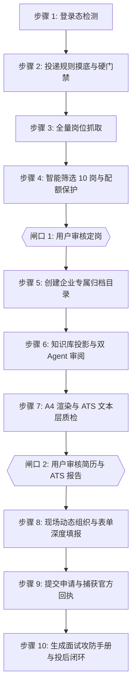

# job-application-pipeline

本技能定义了从获取企业招聘官网到最终完成投递、回执归档并生成面试攻防手册的**全生命周期标准作业规范（SOP）**与**不可违背的行为铁律**。

---

## 核心不可违背铁律（Hard Rules）

1. **两道强制人工审核闸口（Human-in-the-loop Gates）**：
   - **闸口 1（定岗确认）**：扫描岗位并精选出 10 个岗位、标星推荐 Top 3 后，**必须停下来等待用户在聊天中选定岗位**，严禁擅自决定投递岗位。
   - **闸口 2（简历确认）**：简历生成、通过双 Agent 审阅并完成 ATS 质检后，**必须提供文件路径并停下来等待用户审核确认**，严禁未经验收直接在官网提交。

2. **前置门禁防御铁律（Eligibility Gate）**：
   - 杜绝“盲目投递”。结合大厂配额限制（如字节校招仅 2 次机会），在定岗前必须自动核验学历（本科）、年级（2027 届在读）与核心技术栈匹配度，若严重不符必须发出强警告，防止浪费宝贵配额。

3. **履历真实与排版格式铁律**：
   - **实习经历**：苏州深古大数据有限公司，周期严格锁定为 `2026/06 – 2026/08 (3个月)`，**严禁标注“至今”**。
   - **教育背景**：南京中医药大学 · 软件工程（2023–2027），**严禁出现独立的教育背景 H2 板块**，必须单行紧凑嵌入页头正下方；严禁添加“中医药+计算机复合背景”等杂乱徽章。
   - **排版规格**：严格自适应充满 **A4 单页（1 Page Only）**，严禁溢出产生第 2 页，总行数控制在 40~42 行区间。
   - **命名规范**：统一为 `姓名_企业名_岗位名.pdf`，严禁包含“一页精简简历”字样。

4. **双 Agent 交叉审查与 ATS 文本层质检铁律**：
   - **Drafter-Reviewer 审阅**：Drafter 起草后，Reviewer Agent 必须对照 `references/reviewer_rubric.md` 进行苛刻事实审计与红笔圈画，输出 JSON 补丁修复任何瑕疵。
   - **ATS 机器质检**：编译 PDF 后，必须执行 `scripts/verify_ats_and_layout.py`，确保单页 A4、姓名/手机/邮箱 100% 无损检索、核心关键词命中率达标。

5. **真机表单现场动态深度组织（Context-Aware JIT Form Synthesis）**：
   - 严禁机械套用预制静态文本。在 `ego-browser` 自动化网申填表时，Agent 必须读取网页输入框的具体设问、占位提示与字数限制（maxLength），调取底层知识库现场组织针对性极强的个性化高质量回答。
   - 遇到折叠或选填的项目经历（如 `+ 添加项目经历`），**绝不留白**，逐项结构化完整录入。

6. **企业专属闭环与投后面试攻防交付物**：
   - 每次投递必须在桌面建立专属目录：`~/Desktop/求职投递/<企业名称>/`。
   - 交付三大核心成果：
     1. `01_岗位分析与投递规则.md`：配额、隔离规则、底表与精选 10 岗分析；
     2. `刘仁晓君_<企业名>_<岗位名>.pdf`：通过 ATS 检验的定制单页矢量 PDF；
     3. `02_官网投递成功回执.png`：官网提交成功的高清带单号官方截图；
     4. `03_岗位定制面试攻防手册.md`：针对当前投递的简历诱饵埋点、L1-L3 技术深挖反制表、JD 技能盲区破局话术与模拟面试对战指引。

---

## 全生命周期 10 步标准执行流程（SOP）



### 步骤 1：登录态检测（Login Verification）
- 使用 `ego-browser` 进入目标企业招聘官网（复用 task space 1）。
- 检查页面是否已有用户登录标识（如手机号 `1933****407` 或头像）。
- 若未登录或提示验证码，立即调用 `handOffTaskSpace(1)` 交还控制权，提示用户在打开的浏览器中完成登录，用户回复后调用 `takeOverTaskSpace(1)` 恢复接管。

### 步骤 2：投递规则摸底与硬门禁（Rule Probing & Eligibility Gate）
- 探查核心规则：投递配额上限（如最多 2 个）、校招与日常实习是否隔离、挂掉后能否重投。
- 执行 **Eligibility Gate**：严格对齐学历（2027 届本科）、年级与到岗周期，预判是否满足投递门槛。

### 步骤 3：全量岗位抓取（Job Crawling）
- 遍历招聘官网所有开放岗位，地毯式提取：岗位名称、工作城市、部门、所属类别、完整职位描述（JD）与任职要求。

### 步骤 4：智能筛选 10 岗与配额保护（Filtering & Top 10）
- 基于候选人核心画像（AI Agent 架构、全栈交付、RAG/知识库、高并发服务端、微服务架构），对所有岗位进行语义匹配打分。
- 筛选出 **10 个** 最适合的岗位清单，标星 **Top 3 核心推荐**，写明核心交集理由。
- 暂停并向用户汇报清单，等待 **【闸口 1：用户定岗】**。

### 步骤 5：建立企业专属归档目录（Workspace Setup）
- 用户选定目标岗位后，创建目录 `~/Desktop/求职投递/<企业名称>/`。
- 将步骤 2~4 的分析成果写入 `01_岗位分析与投递规则.md` 存入该目录。

### 步骤 6：针对 JD 从知识库定制 A4 简历与双 Agent 审阅（Tailored Building & Dual-Agent Audit）
- **读取底层事实源**：
  - `references/wiki-corpus-bank.md`（5 大专业技能维度重构、4 选 2 深度项目库与 6 大赛道装配矩阵）
  - `/Users/apple/knowledge/career/resume-master-bank.md`（SSOT 核心底库）
- **Drafter 起草**：严格执行“4 选 2”，单行嵌入教育背景，输出 40~42 行紧凑 HTML。
- **Reviewer 审阅**：加载 `references/reviewer_rubric.md` 进行红笔批改，生成 JSON 字符串替换补丁，修补任何不合规之处。

### 步骤 7：A4 渲染与 ATS 文本层质检（Rendering & ATS Verification）
- 调用 CDP `Page.printToPDF` 渲染为矢量 PDF，存至企业归档目录。
- 运行质检脚本：
  ```bash
  python3 /Users/apple/.gemini/config/skills/job-application-pipeline/scripts/verify_ats_and_layout.py --pdf "<pdf_path>" --jd-file "<jd_path>"
  ```
- 验证各项指标：单页拦截（1 页）、联系方式无损度、严禁至今、ATS 关键词覆盖率报告。
- 暂停并向用户展示文件路径与 ATS 质检报告，等待 **【闸口 2：用户审核简历】**。

### 步骤 8：现场动态组织与表单深度填报（Context-Aware JIT Synthesis & Form Audit）
- 用户确认投递后，在页面点击该岗位的「立即投递」。
- 上传已通过 ATS 验证的定制 PDF 附件。
- **现场动态组织长文本**：读取输入框 Label、Placeholder 与 maxlength，结合知识库现场生成针对性自我介绍、业务理解与项目难点描述，无缝注入输入框。
- 展开添加项目经历，完整填入项目名称、角色、时间与量化职责。
- 全页面滚动复核，确保 0 红色报错、0 字段缺失。

### 步骤 9：提交申请与捕获官方回执（Submit & Receipt）
- 点击提交，若有二次确认或意向顺序弹窗，规范确认并提交。
- 跳转至投递成功页面后，自动截图保存至：
  `~/Desktop/求职投递/<企业名称>/02_官网投递成功回执.png`。

### 步骤 10：生成面试攻防手册与投后闭环（Interview Defense & Post-Submission Closure）
- 依据 `references/interview_defense_rubric.md`，基于当前投递的定制简历与 JD，生成专属的：
  `~/Desktop/求职投递/<企业名称>/03_岗位定制面试攻防手册.md`。
- 涵盖简历诱饵埋点、L1-L3 技术深挖反制网、JD 盲区防御话术与模拟面试突击指引。
- 更新 Obsidian Wiki 求职跟踪记录，完成全流程端到端交付。
