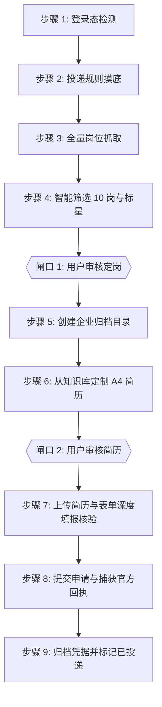

# Job Application Pipeline Skill

企业校招与实习投递全流程自动化 Agent Skill 标准定义。

---

## 核心不可违背铁律（Hard Rules）

1. **两道强制人工审核闸口（Human-in-the-loop Gates）**：
   - **闸口 1（定岗确认）**：扫描岗位并精选出 10 个岗位、标星推荐 Top 3 后，**必须停下来等待用户在聊天中选定岗位**，严禁擅自决定投递岗位。
   - **闸口 2（简历确认）**：简历生成并放入企业目录后，**必须提供文件路径并停下来等待用户审核确认**，严禁未经验收直接在官网提交。

2. **简历与文件命名铁律**：
   - 命名格式统一为：`姓名_企业名_岗位名.pdf`。
   - **严禁**在文件名中包含“一页精简简历”等非专业字样。

3. **履历真实与排版铁律**：
   - **实习经历**：严格锁定真实起止时间，**严禁标注“至今”**。
   - **教育背景**：纯净专业，**严禁添加非标准彩色标签徽章**。
   - **排版规格**：严格自适应充满 **A4 单页（1 Page Only）**，绝不允许溢出产生第 2 页。

4. **表单核验铁律（严禁只传附件）**：
   - 上传定制 PDF 后，**必须展开并逐项审核网页在线表单的所有输入框**。
   - 遇到折叠或选填的「项目经历」，**绝不留白**！必须将针对该岗位定制的 3 个核心项目（项目名称、角色、起止时间、核心职责与量化指标）逐项结构化填入表单输入框，确保 ATS 检索与 HR 快速卡片 100% 捕获关键技能点。

5. **企业专属归档规范**：
   - 每次任务必须建立专属归档目录：`~/Desktop/求职投递/<企业名称>/`。
   - 最终交付四大标准文件：
     1. `01_岗位分析与投递规则.md`
     2. `姓名_企业名_岗位名.pdf`
     3. `02_官网投递成功回执.png`
     4. `投递追踪记录.md`

---

## 全流程 9 步标准执行流程（SOP）

### 步骤 1：登录态检测（Login Verification）
- 使用浏览器进入目标企业招聘官网。
- 检查页面右上角/个人中心是否已有用户登录标识。
- 若未登录或提示验证码，立即调用 Handoff 协议交还控制权由用户登录，完成后恢复接管。

### 步骤 2：投递规则摸底（Rule Probing）
- 在招聘官网常见问题（FAQ）、投递须知或用户个人中心查询关键规则：
  1. 投递配额上限（最多允许同时投递几个岗位）；
  2. 校招/秋招与日常实习是共享配额还是独立分开计算；
  3. 是否支持接受调剂、流程结束后能否再投。

### 步骤 3：全量岗位抓取（Job Crawling）
- 翻页/滚动遍历当前所有开放招聘岗位，地毯式搜集岗位名称、城市、部门、类别与 JD 任职要求。

### 步骤 4：智能筛选 10 岗与标星推荐（Filtering & Top 10）
- 基于候选人核心画像计算语义匹配分，精选 10 个最适合的岗位清单。
- 结合企业规则着重标星 Top 3 最适合岗位，写明推荐契合理由。
- 暂停并向用户汇报清单，等待 **【闸口 1：用户定岗】**。

### 步骤 5：建立企业专属归档目录（Workspace Setup）
- 用户选定目标岗位后，创建目录 `~/Desktop/求职投递/<企业名称>/`。
- 将岗位与规则分析写入 `01_岗位分析与投递规则.md`。

### 步骤 6：针对 JD 从知识库动态定制 A4 简历（Tailored Resume Building）
- 读取候选人事实源，逆向拆解目标岗位 JD 关键词，精选最契合的 **3 个核心项目**。
- 微调实习侧重，注入核心量化指标，调用 Headless CDP 渲染为单页 A4 矢量 PDF。
- 暂停并向用户展示文件路径，等待 **【闸口 2：用户审核简历】**。

### 步骤 7：上传简历与表单深度填报核验（Deep Form Audit）
- 用户确认投递后，进入投递页面上传定制 PDF。
- **逐模块深度核查并主动补全表单**：基础信息、教育背景、实习经历无至今校验、结构化填补三大项目经历文本框，确保 0 报错、0 关键字段留白。

### 步骤 8：提交申请与捕获官方回执（Submit & Receipt）
- 点击提交，处理二次确认弹窗。
- 跳转至投递成功页面后，自动截图保存为 `02_官网投递成功回执.png`。

### 步骤 9：归档凭据并标记已投递（Closure & Archive）
- 在企业目录下创建/更新 `投递追踪记录.md`，状态标记为 `[已投递]`，完成单次任务交付。
